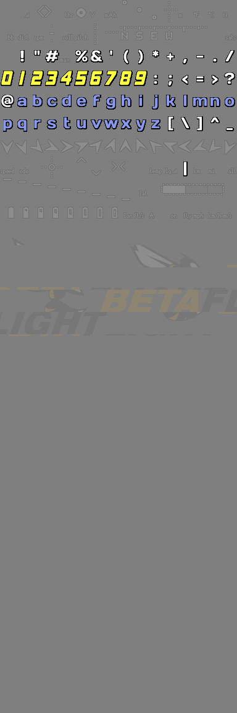
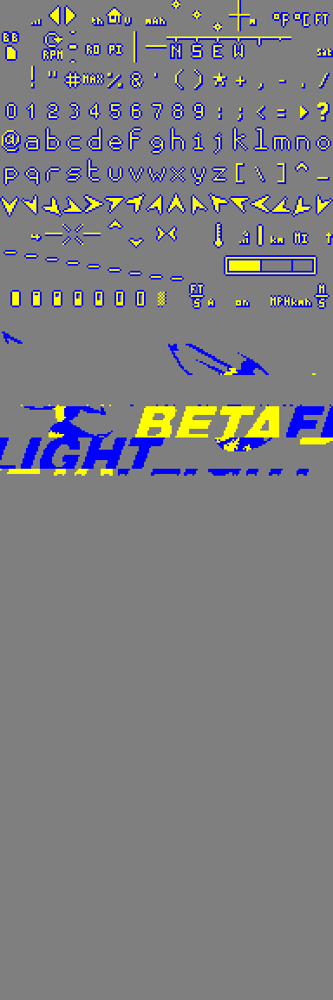

# HD OSD Font Tools

A tool for building and manipulating the HD OSD fonts for HDZERO VRXs and goggles. The initial version is supposed to build HD OSD fonts for the Betaflight (BTLF) FC variant. For the INAV6 FC variant the tool has a limited support to create the logo.

- [HD OSD Font Tools](#hd-osd-font-tools)
  - [Usage](#usage)
  - [Command line options and values](#command-line-options-and-values)
    - [Option `-base`](#option--base)
  - [Option values](#option-values)
    - [Values for bitmaps](#values-for-bitmaps)
    - [Values for .ttf files](#values-for-ttf-files)
    - [Values for .mcm files](#values-for-mcm-files)


## Usage

The tool is command line based with a graphical preview of the built font. User can choose one or more sources to build the font.

The source can be:

- HDZERO OSD font (.bmp)
- true type font file (.ttf)
- Analog OSD font file (.mcm)
- Analog OSD font preview file (.png / .bmp)
- Generic bitmap, typically containing a logo (.png / .bmp / .jpg)

The source can be used as a part of the built font such as:

- all glyphs
- characters
- numbers
- letters
- special characters
- values icons
- units symbols
- home arrow
- AHI elements
- logo
- etc.

## Command line options and values

Typical usage is:

```
fontbuilder.exe -option1 file1 value01 value02 value03 -option2 file2 -option3 -option4
```

or

```
py fontbuilder.py -option1 file1 value01 value02 value03 -option2 file2 -option3 -option4
```

Each option sets the source of the font to be built. The options are processed in order as they are entered. Please note that some options may overwrite the glyphs generated by previous option(s).


### Option `-base`

- sets the base content of the font
- loads all the possible glyphs from the source file
- valid file formats
  - png
  - bmp
  - mcm
  - ttf


## Option values

Option values are dependent on the input file formats. The values tell how the input file is used to render given glyphs. The values must be entered in a given order. None of the values is mandatory.

### Values for bitmaps

Bitmap files (png, bmp) don't support any values, the input bitmap file is taken as-is and is processed automatically. The tool will automatically guess the content of the bitmap and will use it accordingly (glyphs, logo, etc...)

### Values for .ttf files

The .ttf files are TrueType fonts. The tool loads the font renders all the possible glyphs. The render can be altered by a numerous values that allows (almost) pixel perfect outcomes.

Values:
- font size
  - size of the font to be rendered
  - default value: 15
- outline thickness
  - how thick (in px) the outline of the glyph is
  - can be float value
  - default value: 1.5
- glyph vertical stretch
  - how the glyph is vertically stretched compared to default geometry
  - 1 = original, 2 = double height 
  - can be float value
  - default value: 1.5
- glyph x offset
  - horizontal offset (in px) of the glyph within the glyph box
  - can be float value, positive or negative
  - default value: 0
- glyph y offset
  - vertical offset (in px) of the glyph within the glyph box
  - can be float value, positive or negative
  - default value: 0
- glyph outline x offset
  - horizontal offset (in px) of the glyph outline
  - can be float value, positive or negative
  - default value: 0
- glyph outline y offset
  - vertical offset (in px) of the glyph outline
  - can be float value, positive or negative
  - default value: 0
- glyph color
  - a HEX color value with leading '#'
  - default value: #FFFFFF (white)
- outline color
  - a HEX color value with leading '#'
  - default value: #000000 (black)

Exapmple:

```
fontbuilder.exe^
 -base "resources/fonts/BTFL_ondrascz_grey.png"^
 -btflcharacters "resources/ttf/DaysOne-Regular.ttf" 25 1.2 1^
 -btfllowletters "resources/ttf/DaysOne-Regular.ttf" 25 1.2 1 0 0 0 0 #8899EE^
 -btflnumbers "resources/ttf/a4speed.ttf" 22 1.4 1.7 -0.5 4.5 0.1 0.1 #FFFF44^
```

This renders the glyphs based on two different .ttf fonts with three different settings. Please consider the offsets fine tuning of the a4speed.ttf font.



### Values for .mcm files

The .mcm files are fonts definitions for the analog OSD systems. The tool loads the font and double scales it.

Values:
- glyph color
  - a HEX color value with leading '#'
  - default value: #FFFFFF (white)
- outline color
  - a HEX color value with leading '#'
  - default value: #000000 (black)

Exapmple:

```
fontbuilder.exe -base resources/fonts/BTFL_ondrascz.MCM #FFFF00 #0000FF
```

This renders double scaled analog font of yellow glyphs with blue outline.

